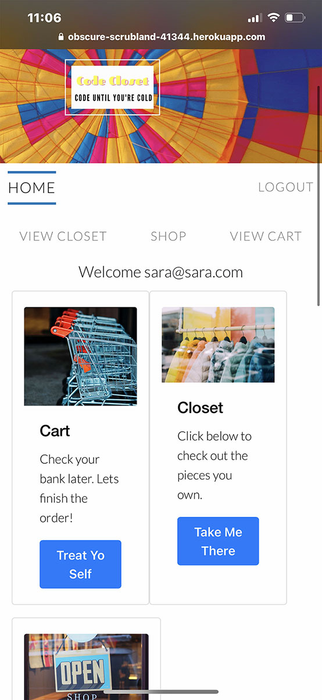
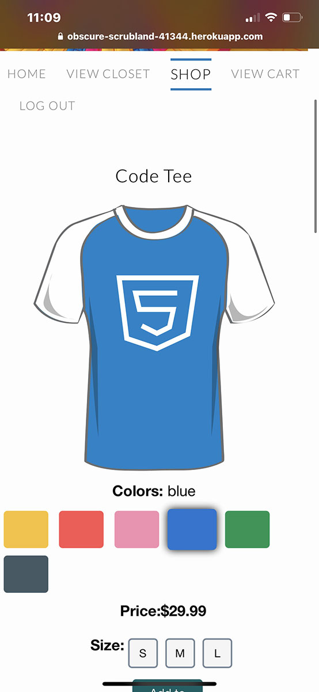
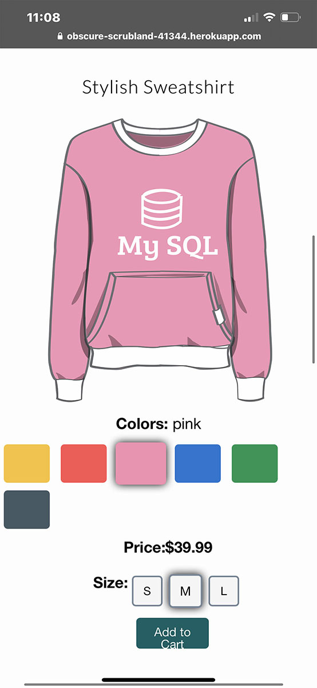

# CodeCloset-P2
Welcome to our awesome project, Code Closet.  This is a speciality shopping site for web
developers who want clothes that are comfortable to code in, and fashionable to zoom in.
This is a full stack project that allows users to create a login, go to the members site
to shop for clothes, review and edit their cart, and finally find a fun surprise waiting in
the closet link.

# Responsive in mobile

# Technologies
HTML, CSS, JavaScript, JQuery, Foundation, Bootstrap, Fontawesome, GitHub, MySQL, JawsDB,
Heroku, Node JS, Adobe Illustrator
 
NPM: fs, bcrypt.js, dotenv, express, express-handlebars, express-session, mysql2, passport, 
     passport-local, sequelize, easter-egg-collection

# How to launch
1. Clone our github repository
2. Install all the NPMs (listed above)
3. Launch the MySQL Workbench in the terminal
4. Run the Node Server.js file in the terminal
5. Launch the LocalHost in the web browser
6. Sign-up and shop!

# Contributors
Youngmee (Olivia) Park- Back End
 
Sara Wilson- Front End
 
Glynis Mullan-Kwok- Back End
 
Nicholas Luberda- Front End

# Website Deploy Links
GitHub: https://github.com/sawi4644/CodeCloset-P2.git

Heroku: https://obscure-scrubland-41344.herokuapp.com
